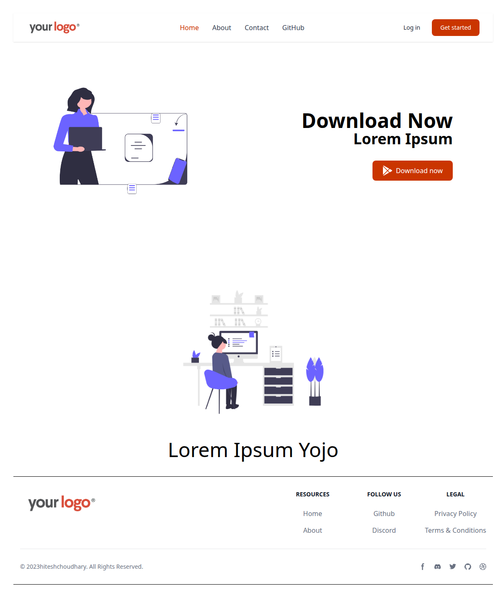
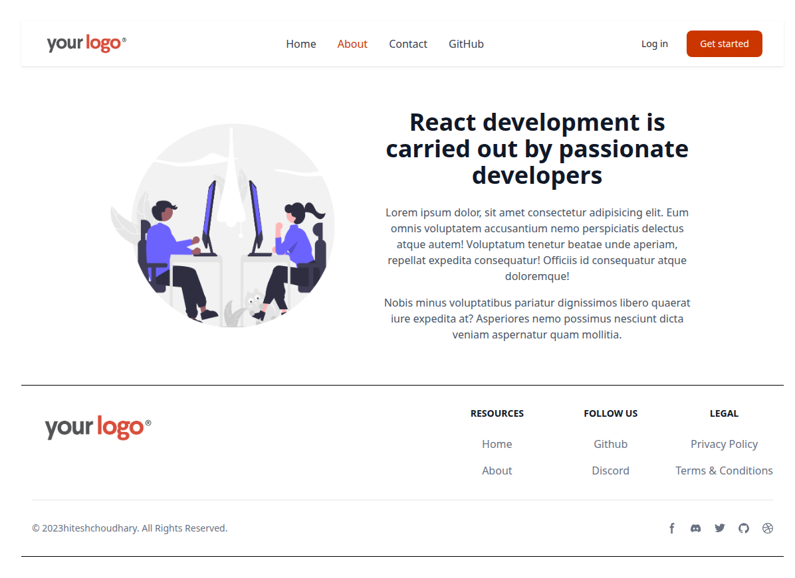
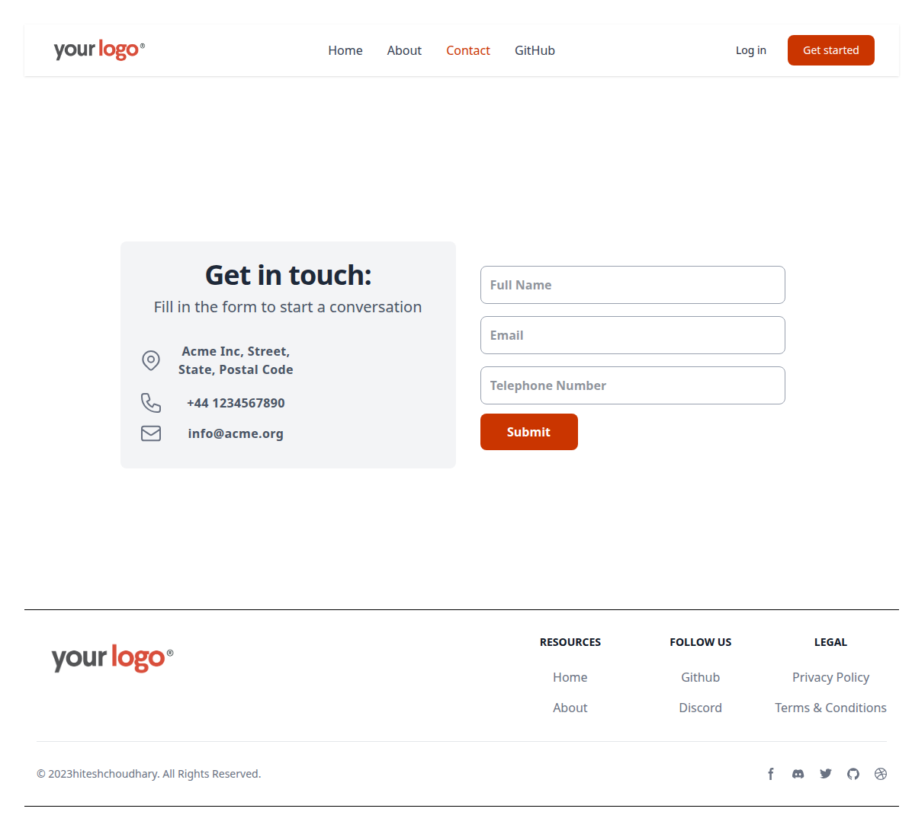

# React Router Website 🧭

A multi-page Single Page Application (SPA) built with React and Tailwind CSS. This project serves as a comprehensive guide to modern **Client-Side Routing**, featuring advanced concepts like Loaders, dynamic parameters, and nested layouts.

## 🚀 Features

- **Client-Side Routing:** Seamless navigation between pages (Home, About, Contact) without page reloads.
- **Data Loaders:** Implements the "Fetch-then-Render" pattern to pre-load GitHub API data before the component mounts.
- **Dynamic Routing:** Handles unique user profiles using URL parameters (`user/:userid`).
- **Nested Layouts:** Uses a master `Layout` component to keep the Header and Footer persistent across all pages.
- **Active Navigation:** Visual feedback on the specific menu item the user is currently viewing.

## 🛠️ Tech Stack

- **Library:** React JS
- **Routing:** React Router DOM (v7)
- **Styling:** Tailwind CSS
- **Build Tool:** Vite

## 🧠 Concepts & Hooks Used

This project was built to master the `react-router-dom` library. Here is how the core concepts are applied:

- **`createBrowserRouter`**: The modern approach to routing. It enables the Data APIs (like Loaders) which aren't possible with the older `BrowserRouter` wrapper.
- **`loader`**: A performance optimization feature. It fetches data (e.g., from the GitHub API) *before* the component renders, preventing "loading spinners" and layout shift.
- **`useLoaderData`**: A custom hook provided by the router to instantly access the data returned by the `loader`, eliminating the need for `useEffect` and `useState` for data fetching.
- **`useParams`**: Used in the User component to extract dynamic values from the URL (e.g., grabbing `hitesh` from `/user/hitesh`) to display personalized content.
- **`NavLink`**: A special version of `Link` that knows whether it is "active". It allows us to conditionally style the navigation menu (e.g., highlighting "Home" in orange when on the Home page).
- **`Outlet`**: The placeholder component used in the parent `Layout`. It dynamically swaps the child content (Home, About, Contact) while keeping the Header and Footer static.

## 🖥️ Screenshots

**Home View**

**About View**

**Contact View**

**Github View**


## 💻 How to Run Locally

1. **Clone the repository**
   ```bash
   git clone [https://github.com/umersaif11/react-router-website.git](https://github.com/umersaif11/react-router-website.git)
   ```

2. Navigate to the project directory
```bash
   cd react-router-website
```    
3. Start the development server
```bash
   npm run dev
```  
   